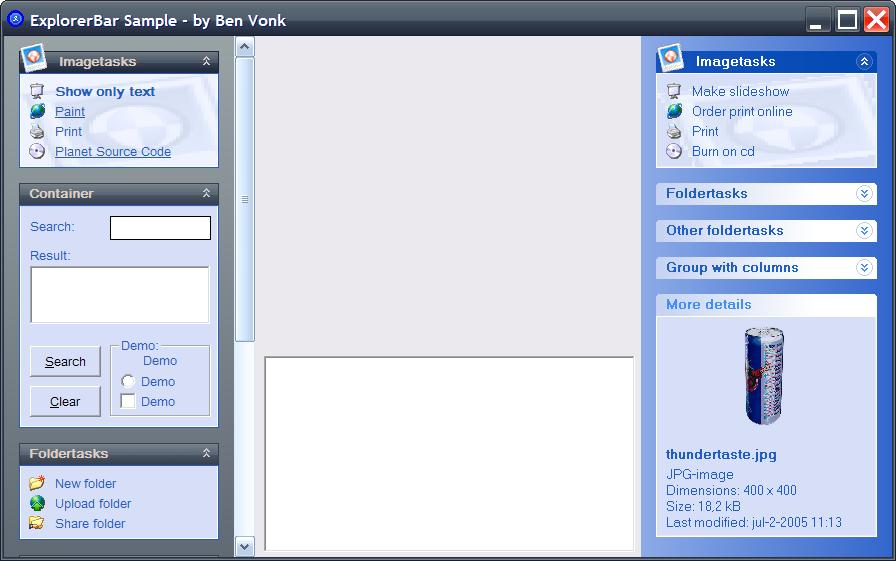



## Windows ExplorerBar control

### Description

Fix some bugs, add some functions and for Items TextOnly property

Change some Function names and the order of some parameters.

Version 3.00 Add new features, and more. See screenshot

For some little explain, look at ReadMe.txt in map Info

Update, mousewheel problem called by zgj7712 fixed.

Update, some bugs are fixed called by Brandon.

And Alex the Award is also for you!

This is a Windows ExplorerBar control. Based on the idea of Alex Flex's 'XP-Style ExplorerBar control'. It is completely redesigned with a lot of settings and functions.
 
### More Info
 

             |
---                |---
**Submitted On**   |2011-12-28 03:00:00
**By**             |[Ben Vonk](https://github.com/Planet-Source-Code/PSCIndex/blob/master/ByAuthor/ben-vonk.md)
**Level**          |Intermediate
**User Rating**    |5.0 (105 globes from 21 users)
**Compatibility**  |VB 6\.0
**Category**       |[Custom Controls/ Forms/  Menus](https://github.com/Planet-Source-Code/PSCIndex/blob/master/ByCategory/custom-controls-forms-menus__1-4.md)
**World**          |[Visual Basic](https://github.com/Planet-Source-Code/PSCIndex/blob/master/ByWorld/visual-basic.md)
**Archive File**   |[Windows\_Ex2220722262012\.zip](https://github.com/Planet-Source-Code/ben-vonk-windows-explorerbar-control__1-71020/archive/master.zip)

